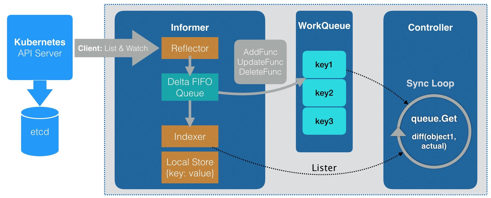

### Kubernetes Defined Controllers

1. CRD 的定义 参考 `sample-controller`, 创建 `CRD` 和 其对应的 `Foo`.

[crd.yaml](https://github.com/kubernetes/sample-controller/blob/master/artifacts/examples/crd.yaml)
```bash
apiVersion: apiextensions.k8s.io/v1beta1
kind: CustomResourceDefinition
metadata:
  name: foos.samplecontroller.k8s.io
spec:
  group: samplecontroller.k8s.io
  version: v1alpha1
  names:
    kind: Foo
    # 复数名
    plural: foos
    # 单数名
    singular: foo
    # 简称，类似 deployment 的简称是 deploy
    shortNames：
    - fo
  scope: Namespaced
```

[example-foo.yaml](https://github.com/kubernetes/sample-controller/blob/master/artifacts/examples/example-foo.yaml)

```bash
apiVersion: samplecontroller.k8s.io/v1alpha1
kind: Foo
metadata:
  name: example-foo
spec:
  deploymentName: example-foo
  replicas: 1
```

`controller 流程`


`ectd 命令 example`
```bash
ETCDCTL_API=3 etcdctl --endpoints=https://127.0.0.1:2379 --cacert=/etc/kubernetes/pki/etcd/ca.crt --cert=/etc/kubernetes/pki/etcd/healthcheck-client.crt --key=/etc/kubernetes/pki/etcd/healthcheck-client.key get /registry/apiextensions.k8s.io/customresourcedefinitions/ --prefix
```

```bash
ETCDCTL_API=3 etcdctl --endpoints=https://127.0.0.1:2379 --cacert=/etc/kubernetes/pki/etcd/ca.crt --cert=/etc/kubernetes/pki/etcd/healthcheck-client.crt --key=/etc/kubernetes/pki/etcd/healthcheck-client.key get /registry/bolingcavalry.k8s.io/students/default/object-student --print-value-only
 ```


