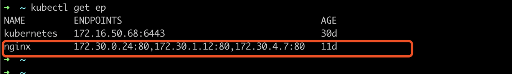
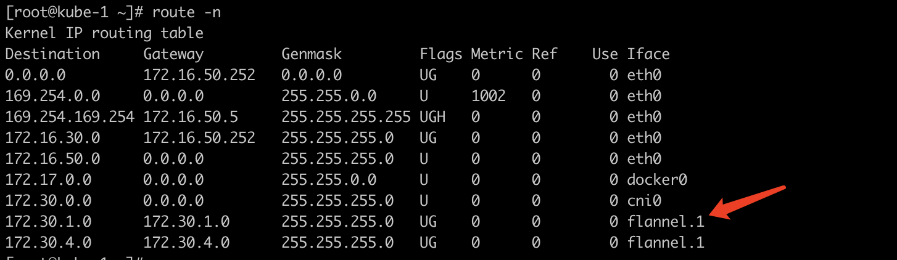

# Service 实现原理分析

- 阅读本文档时，可能因为代理问题，无法正常查看截图

## 环境信息
- kubernetes: v1.18.2
- cri: docker
- cni: flannel
- proxyMode: iptables

## iptables
数据包在linux系统中，是绕不开 iptables 的，因为篇幅问题，本文不对 **iptables** 展开讨论，有兴趣的同学请移步 [Iptables](https://en.wikipedia.org/wiki/Iptables)

### iptables 的四表五链
- **tables**: raw, mangle, filter, nat
- **chains**: PREROUTING, FORWARD, INPUT, OUTPUT, POSTROUTING

    

### kubernetes 支持的 serviceType
  - `ClusterIP`
  - `NodePort`
  - `LoadBalancer`

**ClusterIP**

1. 在 k8s 集群创建一个 `ClusterIP` 类型的 `service`, 其 `ip` 为 `10.254.122.75`, `port` 为 `80`

2. 在集群内的任一节点执行 `curl 10.254.122.75:80` ，可以正常访问服务，通过 `kubectl get ep` 获取对应的后端有若干个 `pod`

***实现流程如下***

3. 数据包首先进入 iptable 的 `PREROUTING` 链，依次进入 `raw` 表、 `mangle` 表、 和 `nat` 表，根据上文总结，k8s 只操作 `nat` 表，直接查看  `PREROUTING` 链的 `nat` 表：

4. 数据包命中，随后数据包进入 `KUBE-SERVICES` 链，先后命中 `KUBE-MARK-MASQ` 和 `KUBE-SVC-4N57TFCL4MD7ZTDA` 链

4. 数据包随后进入 `KUBE-MARK-MASQ` 链，k8s 为该报文打上 `0x4000` 的标记 (具体用途后续介绍)

6. 然后报文进入 `KUBE-SVC-4N57TFCL4MD7ZTDA` 链，并在其规则中完成 `loadbalance`, 本例中，报文随机命中 `KUBE-SEP-EZ6FKUNEIONYFN4Z` 链

7. 随后报文进入 `KUBE-SEP-EZ6FKUNEIONYFN4Z` 链，并在该链中完成 `dnat`，实现从 `service ip` 到实际 endpoint `pod id` 的转换，对应 `kubectl get ep` 获取到的后端

8. 完成 `dnat` 之后，报文完成所有 `PREROUTING` 链，进入 `routering decision` 阶段，
数据报文的 `源ip` 为本地ip，目的ip 为 dnat 之后的 ip ，查看本地路由, 此时有两种情况，会在步骤 **9** 和 **10** 中分别讨论

    - 命中本节点，报文进入 cni0 设备
    - 命中其他节点，报文进入 flannel.1 设备

9. 路由命中本节点场景分析 (endpoint 为 172.30.0.35:80)
    - 命中本地的数据包， 依次进入 `INPUT` 链的 `mangle` 和 `filter` 表，未命中任何规则，直接通过
    - 数据包到达 `cni0` 设备， `cni0` 设备是一个 `linux bridge`，作为宿主机上所有 `pod` 的网关 通过 `arp寻址` 数据包顺利到达 `pod`
    - `pod` 完成对数据包的处理
    - 数据包在处理完之后，进入 `routering decision` 阶段，路由后，依次进入 `OUTPUT` 链的 `raw`, `mangle`, `nat`, `filter` 表，未命中任何规则，直接通过
    - 数据包通过 `OUTPUT` 链后, 进行 `routering decision` ，随后数据包进入 `POSTROUTING` 链的 `mangle` 和 `nat` 表, `mangle` 表直接通过，数据包进入 `nat` 表会命中 `KUBE-POSTROUTING` 链，根据 `KUBE-MARK-MASQ` 的 `MARK` 完成 `MASQUERADE` . 至此，整个流程结束.
    

10.  路由命中其他节点场景分析 (endpoint 为 172.30.4.43:80)
    - 命中其他节点的数据包，将依次进入 `FORWARD` 链的 `mangle` 和 `filter` 表，命中 `filter` 表的 `KUBE-FORWARD` 链，完成 `FORWARD`.
    
    - 数据包进入 `routering decision` 阶段的, 其 `目的ip` 为 `172.30.1.43`, 根据路由，出口为 `flannel.1` 下一条为 `172.30.4.0`
    
    - 随后数据包进入 `POSTROUTING` 链的 `mangle` 和 `nat` 表，命中 `nat` 表的 `KUBE-POSTROUTING`,  完成 `MASQUERADE` 后，数据包离开本机，到达目的主机
    

- 无头服务(headless)在服务&外传区讨论，此处不做赘述

**NodePort**

1. 创建一个 `NodePort` 类型的 `service`，访问集群的任一台节点的 ip + port（本例为31980）均可以正常连接

2. 查看被访问的节点（或者是任意节点）的 `iptables` 规则，数据包先后进入 `PREROUTING` 链的 `raw` 表，`mangle` 表， 和 `nat` 表（前文已介绍，raw 和 mangle 表均没有规则，默认通过），直接查看 `nat` 表规则

3. 和 `ClusterIP` 场景相关，数据包会命中 `PREROUTING` 的 `KUBE-SERVICES` 链，然后命中其子链 `KUBE-NODEPORTS`

4. 数据包进入 `KUBE-NODEPORTS` 后，根据 `dpt` 先后命中 `KUBE-MARK-MASQ`(0x4000) 和 `KUBE-SVC-37ROJ3MK6RKFMQ2B` 并在 `KUBE-SVC-37ROJ3MK6RKFMQ2B` 链中完成负载均衡 (statistic mode random)

5. 随后数据包进入负载均衡之后的链中，本例是 `KUBE-SEP-4XK7BREWKZE733EB` 链，查看 `KUBE-SEP-4XK7BREWKZE733EB` 规则，发现数据包命中 `dnat` 规则，在此完成 `nodeport:port` 到 `pod:port` 的转换，数据包会根据 `dnat` 后的 `目的ip`，匹配路由，到达后端 `pod`, 此时分两种情况，在 **6** 和 **7** 中分别讨论

6. `pod` 不在本节点，以 `172.30.1.53:80` 为例，此时数据包已通过 `PREROUTING`链, 根据 `路由`，将从 `flannel.1` 设备到达下一跳 `172.30.1.0`, 然后数据包进入 `FORWARD` 链

    
    - 数据包依次通过 `FORWARD` 的 `mangle` 和 `filter` 表，命中 `filter` 的 `KUBE-FORWARD` 链的两条规则 (0x4000/0x4000)， 直接通过 `FORWARD` 链
     
    - 数据包在通过 `FORWARD` 之后，未对数据包做修改，直接进入 `POSTROUTING` 链
    - 数据包进入 `POSTROUTING` 链的 `mangle` 和 `nat` 表, 命中 `nat` 表的 `KUBE-POSTROUTING` 链，完成 `MASQUERADE`, 进行 `snat`
        
    - 然后数据包命中 `POSTROUTING` 的 `RETURN` 规则，数据包完成全部规则，即将离开本节点，去往下一跳, 此时数据包的源ip为本节点 `flannel.1` 的地址（伪装）, 目的地址为后端 `pod` 地址
        
    - 然后数据包被送到目的 `pod` 所在的节点，进入其 `PREROUTING` 链, 依次通过 `raw`, `mangle`, `nat` 表, 未命中任何规则，然后数据包进行路由，根据路由表，数据包会被送到 `cni0` 设备，
       
    - `cni0` 是本地设备，意味着数据包会进入 `INPUT` 链，依次通过 `mangle` 和 `filter` 表, 未命中规则，然后进行 `Local Process` （处理过程忽略）
    - `Local Process` 之后，数据包进入 `OUTPUT` 链， 依次通过 `raw`, `mangle`, `nat` 表，未命中规则
    - 然后数据包进入 `route decsion`，目前数据包的 `源ip` 是 pod 的 ip ，`目的ip` 是之前 node 节点的 `flannelf.1` 的 ip, 根据路由，数据包通过 `flannelf.1` 设备前往对端的 `flannelf.1` 网关是 `172.30.0.0`
       
    - 然后数据包进入 `POSTROUTING` 链, 依次通过 `mangle` 和 `nat` 表， 命中 `nat` 表的 `RETURN`, 完成 `目的节点` 的所有操作, 根据路由，数据包被送会 `源节点`.
       
    - 数据包达到 `源节点` (`源ip` 为 `pod ip`，`目的ip` 为 `172.30.0.0/32`), 依次通过 `PREROUTING` 的 `raw`, `mangle` 和 `nat` 表，未命中规则，进入 `route decsion` 阶段，命中默认路由
       
    - 随后数据包进入 `FORWARD` 链的 `mangle` 和 `filter` 表，命中 `KUBE-FORWARD` 的规则，快速通过 `FORWARD` 链
       
    - 随后数据包进入 `POSTROUTING` 的 `mangle` 和 `nat` 表，命中 `nat` 表的 `KUBE-POSTROUTING` 链, 完成 `snat` (MASQUERADE)
       
    - 完成 `POSTROUTING` 链之后，数据包正式离开 `node` 节点，返回给外端的请求端. 至此，整个流程结束.

7. `pod` 在本节点, 以 `172.30.3.2:80` 为例, 此时数据包已通过 `PREROUTING` 链

    - 根据路由，命中本地，数据包将被送到容器网关 `cni0` 设备
  
    - 数据包依次进入 `INPUT` 链的 `mangle` 和 `filter` 表，未命中任何规则，直接通过
    - 数据包在处理完之后，进入 routering decision 阶段，路由后，依次进入 OUTPUT 链的 raw, mangle, nat, filter 表，未命中任何规则，直接通过
    - 数据包通过 `OUTPUT` 链后, 进行 `routering decision` ，随后数据包进入 `POSTROUTING` 链的 `mangle` 和 `nat` 表, `mangle` 表直接通过，数据包进入 `nat` 表会命中 `KUBE-POSTROUTING` 链，根据 `KUBE-MARK-MASQ` 的 MARK 完成 `MASQUERADE`. 然后 `数据包` 根据 `conntrack` 离开宿主机. 至此，整个流程结束.

**LoadBalancer**

   - 参考 **NodePort** 章节，**LoadBalancer** 和 **NodePort** 集群内实现原理大致相同，又因云厂商 `provider` 有所差异

### 服务&外传区

**ClusterIP(headless)**

1. 什么是无头服务？[Headless Service](https://kubernetes.io/docs/concepts/services-networking/service/#headless-services)

2. 创建一个无头服务 —— 指定服务类型为 `ClusterIP`, 且设置 `Spec.ClusterIP` 为 `None`， 对于无头服务，`kubernetes` 不会为其分配 `ClusterIP`, `kube-proxy` 也不会处理(无规则下发)，由 `dns` 根据 `selector` 自动配置转发：

    - 如果配置 `selector`, `DNS` 直接指向后端 `pods`
    - 如果未配置 `selector`, `DNS` 指向和 `service` 名称相同的任意后端, 或 externalName 类型的服务

3. `headless service` 对应的 `endpoints`

4. 通过 `nslookup` 解析无头服务域名对应的后端ip

5. 综上所述，无头服务通过 `dns` 的能力实现 `loadbalance` ，不经过 `kubernetes` 转发实现机制，直接将请求转发到后端的 `pod` 上

**ExternalName**

1. 直接作用于域名（可以用作 `kubernetes` 的跨 `namespaces` 服务访问）
   - `服务名`是 `namespaces` 隔离的 (test-svc.default.svc.cluster.local)
   - `ClusterIP` 是非 `namespaces` 隔离的
