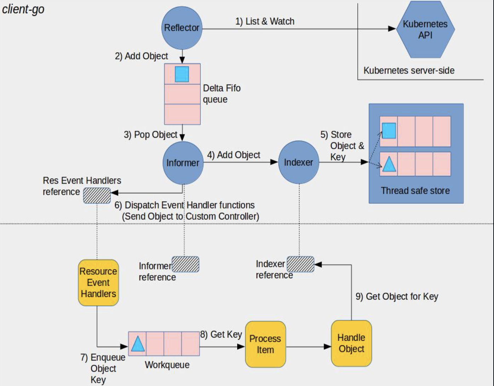

# Informer 原理分析

#### 开局一张图


#### client-go components
* Reflector: 用来直接和 kuber api server 通信，内部实现了 listwatch 机制，listwatch 就是用来监听资源变化的，一个listwatch 只对应一个资源，这个资源可以是 k8s 中内部的资源也可以是自定义的资源，当收到资源变化时(创建、删除、修改)时会将资源放到 Delta Fifo 队列中.

* Informer: 监听的资源的一个代码抽象，在 controller 的驱动下运行，能够将 delta filo 队列中的数据弹出处理.

* Indexer: 构建安全的本地储存，在自定义 controller 中处理对象时就是基于对象的索引在本地缓存将对象查询出来进行处理.

#### Demo
    ```
    package main

    import (
        "flag"
        "log"
        "time"

        v1 "k8s.io/apimachinery/pkg/apis/meta/v1"
        "k8s.io/client-go/informers"
        "k8s.io/client-go/kubernetes"
        "k8s.io/client-go/tools/cache"
        "k8s.io/client-go/tools/clientcmd"
    )

    func main() {
        kubeconfig := flag.String("kubeconfig", "/Users/caoyuan/.kube/config", "(optional) absolute path to the kubeconfig file")
        flag.Parse()

        config, err := clientcmd.BuildConfigFromFlags("", *kubeconfig)
        if err != nil {
            panic(err)
        }

        clientset, err := kubernetes.NewForConfig(config)
        if err != nil {
            panic(err)
        }

        stopCh := make(chan struct{})
        defer close(stopCh)
        sharedInformers := informers.NewSharedInformerFactory(clientset, time.Minute)

        informer := sharedInformers.Core().V1().Services().Informer()

        informer.AddEventHandler(cache.ResourceEventHandlerFuncs{
            AddFunc: func(obj interface{}) {
                mObj := obj.(v1.Object)
                log.Printf("New Services Added to Store: %s", mObj.GetName())
            },
            UpdateFunc: func(oldObj, newObj interface{}) {
                oObj := oldObj.(v1.Object)
                nObj := newObj.(v1.Object)
                log.Printf("%s Services Updated to %s", oObj.GetName(), nObj.GetName())
            },
            DeleteFunc: func(obj interface{}) {
                mObj := obj.(v1.Object)
                log.Printf("Services Deleted from Store: %s", mObj.GetName())
            },
        })

        informer.Run(stopCh)
    }
    ```

