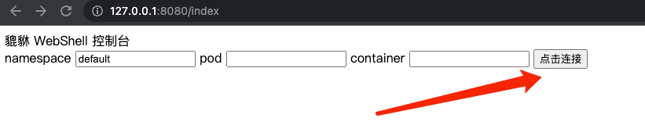
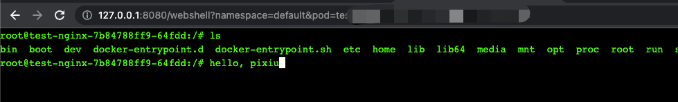

# WebShell demo

通过 `webshell` 连接到 `kubernetes` 集群的指定 pod，并执行相互操作

## 使用工具
  - gin
  - client-go
  - sockjs

## 执行

### 启动后端进程
```shell
# 默认读取 ~/.kube/confg 的 kubeconfig，可根据需要修改
go run webshell.go 
```

### 打开浏览器输入 `127.0.0.1:8080`


### 输入并点击连接

